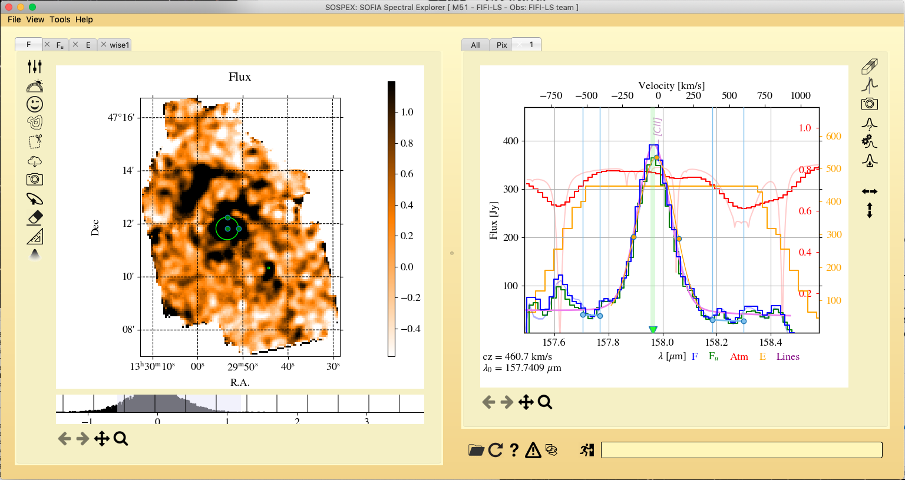

# 

**sospex** is a GUI tool to display and analyse [SOFIA](https://www.sofia.usra.edu) ([FIFI-LS](https://www.sofia.usra.edu/science/instruments/fifi-ls) and [GREAT](https://www.sofia.usra.edu/science/instruments/great)) and [Herschel](http://sci.esa.int/herschel/) ([PACS](https://www.cosmos.esa.int/web/herschel/pacs-overview)) spectral cubes.

# 

- **How to install:** https://github.com/darioflute/sospex/blob/master/INSTALL.md
- **Tutorials:** https://nbviewer.jupyter.org/github/darioflute/sospex/blob/master/sospex/help/tutorials.html
- **Bug reports:** https://github.com/darioflute/sospex/issues

Cubes are shown as images (spatial images at given wavelengths) and spectra (plots in a sky direction). Cubes can be explored by moving the cursor on the image and a bar on the spectrum. Spectra can be extracted by defining apertures on the image and fitted with line models.
By selecting a range on the spectrum, the average spatial emission in the wavelength range is displayed. Cubes can be manipolated (cropped and trimmed) and moments of the emission can be computed and displayed. 
External images can be opened in auxiliary tabs and their contours can be overplotted on the other image tabs. External cubes can be uploaded to plot their spectra over the cube spectrum. 
